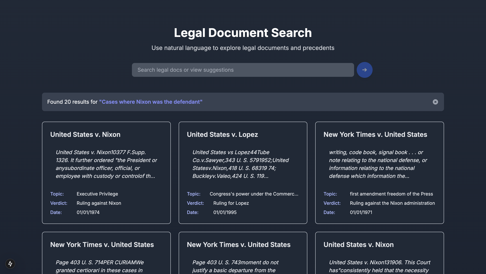

# Leagal Search App

⚖️ Legal Search is an innovative platform that enables users to search and explore legal cases worldwide, providing efficient access to case laws, legal precedents, and comprehensive research tools.

 

More about project

 
The **Legal Document Search** is a web application that allows users to efficiently explore and search through a collection of legal documents using natural language queries. This app is designed to assist legal professionals, researchers, and anyone interested in legal precedents by providing an easy-to-use interface to search for relevant cases, rulings, and legal concepts.
 
The application leverages a robust backend index of legal documents, which can be dynamically updated and searched in real-time. Users can search for specific cases, statutes, or legal issues, and view detailed results with metadata, including topic, verdict, and date.

 

## Key Features:
- **Natural Language Search:** Users can search for cases or legal content using plain language queries.
- **Bootstrap Procedure:** The app ensures that the legal document index is pre-processed and ready for searching.
- **Search Results Display:** Displays a list of relevant documents with metadata such as title, topic, verdict, and date.
- **Document Preview:** Click on a result to view the full document and quote section.
- **Suggested Searches:** The app provides a list of suggested search queries to guide users in exploring specific legal topics.
- **Error Handling:** Displays informative error messages when the search or bootstrap procedure fails.

## Contributing
Contributions are welcome! If you'd like to contribute to this project, please follow these steps:

- Fork the repository & Star the repository
- Create a new branch (git checkout -b feature)
- Make your changes
- Commit your changes (git commit -am 'Add new feature')
- Push to the branch (git push origin feature)
- Create a new Pull Request

## License
This project is licensed under the MIT License - see the [LICENSE](https://github.com/Vaibhav-kesarwani/Legal-search/blob/main/LICENSE) file for details.